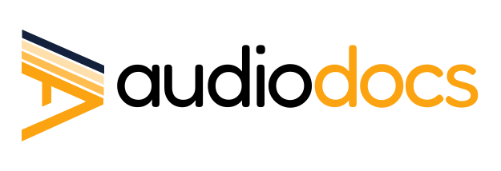

<p align="center">
  
</p>

# Audiodocs

Plataforma para transformar artículos web en una experiencia tipo podcast. Extrae texto de cualquier URL, lo organiza en una biblioteca personal y lo reproduce con voces neuronales de alta definición (Edge TTS) o voz del sistema (Web Speech API), con soporte nativo para reproducción en segundo plano, Apple CarPlay y Bluetooth.

## Características

- **Doble motor de audio**: Voz neuronal (Edge TTS, compatible con bloqueo de pantalla y CarPlay) y voz local (Web Speech API, resalte de palabra en tiempo real).
- **Importador inteligente**: Ingresa una URL y el scraper extrae el texto limpio usando `linkedom` + `@mozilla/readability`. Protección SSRF, timeout de 10s y límite de 5MB por página.
- **Cola de reproducción**: Agrega artículos a una cola desde el menú ⋮ de cada card. Al terminar un artículo avanza automáticamente al siguiente.
- **Biblioteca offline**: Artículos guardados en `localStorage` (máx. 50, purga automática a 30 días).
- **PWA instalable**: Manifest + iconos, funciona en móvil como app nativa.
- **Reproductor flotante**: Persiste entre páginas gracias al App Router de Next.js.

## Stack

| | |
|---|---|
| Framework | Next.js 16.x (App Router) |
| Lenguaje | TypeScript 5 |
| Estilos | Vanilla CSS (globals.css) |
| Iconos | FontAwesome 6 (npm) |
| Scraping | `linkedom`, `@mozilla/readability` |
| TTS | `edge-tts-universal` + Web Speech API |
| Storage | localStorage (offline-first) |
| Deploy | Vercel |

## Requisitos

- Node.js 20.9+
- npm 10+

## Desarrollo local

```bash
git clone <repo>
cd audioblog
npm install
npm run dev
```

Abre [http://localhost:3000](http://localhost:3000).

## Deploy

```bash
npm run build
npm start
```

Desplegado en **https://audiodocs.cl/app**

---

*Desarrollado con IA y diseñado con amor y obsesión por los detalles.*
